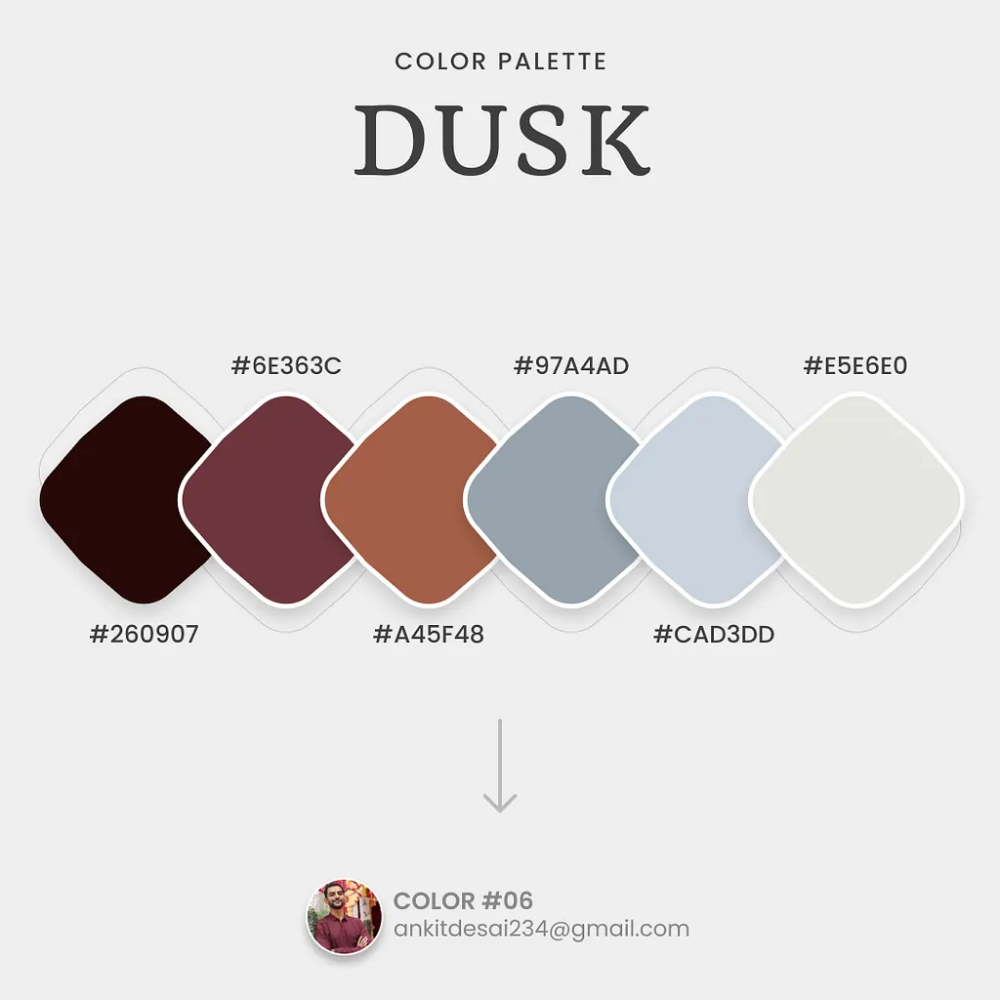
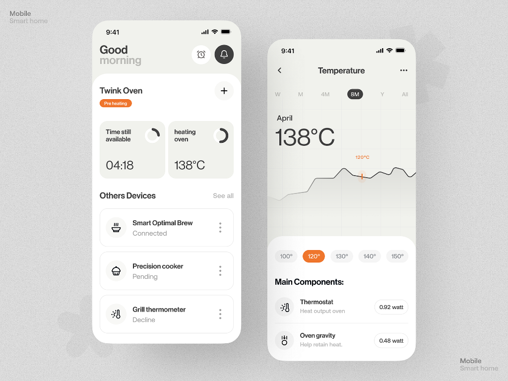

# WhoDoes - UI/UX Design System

## 🎨 Design Philosophy

**WhoDoes** nutzt ein warmes, minimalistisches Design basierend auf der **"Dusk" Color Palette**. Die App soll:
- ✅ **Warm & einladend** wirken (Dusk-Farben statt kühles Blau)
- ✅ **Minimalistisch** sein (viel Whitespace, cleane Cards)
- ✅ **Schnell bedienbar** sein (max. 2 Taps für häufige Aktionen)
- ✅ **Beruhigend** wirken (sanfte Kontraste, keine grellen Farben)
- ✅ **iPhone-optimiert** sein (PWA, große Touch-Targets)

**Design-Inspiration:** Smart Home Apps - clean, card-based, viel Luft zum Atmen.

---

## 📐 Design-Referenzen

### Color Palette



**Basis-Farben:**
- #260907 - Deep Brown (Darkest)
- #6E363C - Burgundy
- #A45F48 - Terracotta
- #97A4AD - Slate Blue
- #CAD3DD - Light Slate
- #E5E6E0 - Warm Beige

### Design Style Reference



**Design-Merkmale:**
- Große, weiche Border Radius (16-20px)
- Subtile Schatten
- Viel Whitespace zwischen Elementen
- Clean, card-based Layout
- Beiger Background für Wärme
- White Cards für Kontrast

---

## 🎨 Farbschema: "Dusk" Palette

### Basis-Farben (Dusk Palette)

```css
--color-darkest: #260907;      /* Deep Brown - Sehr dunkler Text, Icons */
--color-burgundy: #6E363C;     /* Burgundy - Primär-Akzent, wichtige Elemente */
--color-terracotta: #A45F48;   /* Terracotta - Sekundär-Akzent, warme Actions */
--color-slate: #97A4AD;        /* Slate Blue - Subtile Elemente, inactive states */
--color-light-slate: #CAD3DD;  /* Light Slate - Borders, dividers */
--color-beige: #E5E6E0;        /* Warm Beige - Main Background */
```

### Funktionale Farben (abgeleitet von Dusk)

```css
/* Primary Actions & Highlights */
--color-primary: #A45F48;          /* Terracotta - Buttons, Links */
--color-primary-dark: #8B4A36;     /* Darker Terracotta - Hover */
--color-primary-light: #D4A89A;    /* Light Terracotta - Backgrounds */

/* Surface & Background */
--color-background: #E5E6E0;       /* Beige - App Background */
--color-surface: #FFFFFF;          /* White - Cards (leichter Kontrast) */
--color-surface-secondary: #F5F5F1; /* Off-white - Alternative Cards */

/* Text */
--color-text: #260907;             /* Dark Brown - Primary Text */
--color-text-secondary: #6E363C;   /* Burgundy - Secondary Text */
--color-text-muted: #97A4AD;       /* Slate - Muted Text, Placeholders */

/* Borders & Dividers */
--color-border: #CAD3DD;           /* Light Slate - Subtle Borders */
--color-border-dark: #97A4AD;      /* Slate - Stronger Borders */

/* Semantic Colors (angepasst an Palette) */
--color-success: #6E7C52;          /* Earthy Green (passt zur Palette) */
--color-warning: #D4A45F;          /* Warm Gold */
--color-error: #6E363C;            /* Burgundy (aus Palette) */
--color-info: #97A4AD;             /* Slate (aus Palette) */

/* Partner Colors (aus Palette) */
--color-partner-a: #6E363C;        /* Burgundy - Partner A */
--color-partner-b: #A45F48;        /* Terracotta - Partner B */
```

### Accent Color (für wichtige Actions)

```css
--color-accent: #D4793B;           /* Orange (wie im Referenz-Design) */
--color-accent-hover: #B8652E;     /* Darker Orange */
```

---

## 📝 Typography

### Font Family

```css
font-family: 'Inter', -apple-system, BlinkMacSystemFont, 'Segoe UI', sans-serif;
```

**Import:**
```html
<link href="https://fonts.googleapis.com/css2?family=Inter:wght@400;500;600;700&display=swap" rel="stylesheet">
```

### Font Sizes

| Element | Size | Weight | Usage |
|---------|------|--------|-------|
| **H1** | 2rem (32px) | 700 | Page Titles |
| **H2** | 1.5rem (24px) | 600 | Section Headers |
| **H3** | 1.25rem (20px) | 600 | Card Titles |
| **Body** | 1rem (16px) | 400 | Standard Text |
| **Small** | 0.875rem (14px) | 400 | Secondary Info |
| **Tiny** | 0.75rem (12px) | 500 | Labels, Badges |

### Line Height

```css
--line-height-tight: 1.25;   /* Headings */
--line-height-normal: 1.5;   /* Body */
--line-height-relaxed: 1.75; /* Long Text */
```

---

## 🧩 Spacing System

Verwendung eines 4px-basierten Spacing-Systems:

```css
--spacing-1: 0.25rem;  /* 4px */
--spacing-2: 0.5rem;   /* 8px */
--spacing-3: 0.75rem;  /* 12px */
--spacing-4: 1rem;     /* 16px */
--spacing-5: 1.25rem;  /* 20px */
--spacing-6: 1.5rem;   /* 24px */
--spacing-8: 2rem;     /* 32px */
--spacing-10: 2.5rem;  /* 40px */
--spacing-12: 3rem;    /* 48px */
```

---

## 🔘 Buttons

### Primary Button

**Specs:**
- Background: `--color-primary` (#A45F48 Terracotta)
- Text: White (#FFFFFF), 600 weight
- Padding: `14px 28px` (spacing-3.5 spacing-7)
- Border Radius: `16px` (größer, weicher)
- Height: `56px` (größer, Touch-optimiert)
- Shadow: `0 2px 8px rgba(164, 95, 72, 0.15)`
- Hover: `--color-primary-dark` + Shadow: `0 4px 12px rgba(164, 95, 72, 0.25)`
- Transition: `all 200ms ease`

### Secondary Button

**Specs:**
- Background: `--color-surface` (White)
- Border: `1px solid --color-border` (#CAD3DD)
- Text: `--color-text` (#260907), 600 weight
- Padding: `14px 28px`
- Border Radius: `16px`
- Height: `56px`
- Shadow: `0 1px 3px rgba(0, 0, 0, 0.05)`
- Hover: `background: --color-surface-secondary`, Shadow: `0 2px 6px rgba(0, 0, 0, 0.08)`

### Accent Button (für wichtige Actions wie "Erledigen")

**Specs:**
- Background: `--color-accent` (#D4793B Orange)
- Text: White, 600 weight
- Padding: `14px 28px`
- Border Radius: `16px`
- Height: `56px`
- Shadow: `0 2px 8px rgba(212, 121, 59, 0.2)`
- Hover: `--color-accent-hover`

### Icon Button

**Specs:**
- Size: `48px × 48px` (größer)
- Border Radius: `12px`
- Background: `--color-surface` (nur bei Hover)
- Icon: 24px, color: `--color-text-secondary`
- Hover: `background: --color-surface`, Shadow: `0 1px 4px rgba(0, 0, 0, 0.05)`

---

## 🎴 Cards

### Standard Card (basierend auf Referenz-Design)

```
┌─────────────────────────────────────┐
│                                      │
│  Müll rausbringen            5 Pkt  │
│  Zuletzt: Vor 2 Tagen               │
│                                      │
│  [Erledigen]                    ⭐   │
│                                      │
└─────────────────────────────────────┘
```

**Specs:**
- Background: `--color-surface` (#FFFFFF)
- Border: None (kein Border!)
- Border Radius: `20px` (sehr weich, wie im Referenz-Design)
- Padding: `20px` (spacing-5)
- Shadow: `0 2px 12px rgba(38, 9, 7, 0.06)` (sehr subtil)
- Hover: `shadow: 0 4px 16px rgba(38, 9, 7, 0.1)`, Transform: `translateY(-2px)`
- Transition: `all 300ms ease`

### Compact Card (für Listen)

**Specs:**
- Background: `--color-surface`
- Border Radius: `16px`
- Padding: `16px` (spacing-4)
- Shadow: `0 1px 6px rgba(38, 9, 7, 0.05)`
- Gap zwischen Cards: `12px`

### Completion Card (Historie)

```
┌─────────────────────────────────────┐
│  🧹 Bad putzen                      │
│  Anna • 15 Punkte • Heute, 14:30   │
└─────────────────────────────────────┘
```

**Specs:**
- Background: `--color-surface`
- Border-left: `4px solid partner-color` (Burgundy oder Terracotta)
- Border Radius: `12px`
- Padding: `14px` (spacing-3.5)
- Shadow: `0 1px 4px rgba(38, 9, 7, 0.04)`

### Info Card / Stats Card

**Specs (wie im Referenz-Design):**
- Background: `--color-surface-secondary` (#F5F5F1) für Kontrast
- Border Radius: `20px`
- Padding: `24px`
- Shadow: None oder sehr subtil `0 1px 3px rgba(0, 0, 0, 0.03)`

---

## 📊 Komponenten-Übersicht

### 1. Navigation (Bottom Tab Bar)

```
┌─────────────────────────────────────┐
│                                      │
│         [App Content]                │
│                                      │
└─────────────────────────────────────┘
┌─────────────────────────────────────┐
│  🏠 Home  ✓ Aufg.  📊 Pkt  ⚙️ Set   │
└─────────────────────────────────────┘
```

**Tabs:**
- Home (Quick Actions)
- Aufgaben (Task Management)
- Punkte (Points Comparison)
- Settings (Profile & Reset)

**Specs:**
- Position: Fixed Bottom
- Height: `72px` (Safe Area berücksichtigen)
- Icons: 24px
- Active: `--color-primary`
- Inactive: `--color-text-secondary`

### 2. Task Card (Hauptkomponente)

**Varianten:**
- Default (nicht erledigt)
- Completed (heute erledigt, grüner Checkmark)
- Favorit (gelber Stern oben rechts)

**States:**
- Default
- Hover (leichter Shadow)
- Active (beim Drücken, leichte Scale)

### 3. Points Display

```
┌─────────────────────────────────────┐
│  Diese Woche                         │
│                                      │
│  Max         ████████░░  42 Punkte  │
│  Anna        ██████████  58 Punkte  │
│                                      │
│  58% Anna • 42% Max                  │
└─────────────────────────────────────┘
```

**Specs:**
- Progress Bars mit Partner-Farben
- Größere Zahl = größere Schrift + Bold
- Prozentanzeige zentral

### 4. Quick Action Button (Home)

```
┌─────────────────┐
│  🗑️              │
│  Müll raus      │
│  5 Pkt          │
└─────────────────┘
```

**Specs:**
- Größer als normale Cards
- Grid Layout (2 Spalten auf iPhone)
- Touch Target: min. `80px × 80px`
- Emoji/Icon: 32px

### 5. Partner Selector

```
┌─────────────────────────────────────┐
│  Wer bist du?                        │
│                                      │
│  ┌──────────┐      ┌──────────┐    │
│  │    😊    │      │    🙂    │    │
│  │   Max    │      │   Anna   │    │
│  └──────────┘      └──────────┘    │
└─────────────────────────────────────┘
```

**Specs:**
- Zwei große Buttons nebeneinander
- Avatar/Emoji: 48px
- Aktiver Partner: Border + Primary Color
- Padding: `24px` (spacing-6)

### 6. Time Range Filter

```
[ Heute ]  [ Woche ]  [ Monat ]
   ────
```

**Specs:**
- Segmented Control Style
- Aktiv: Underline + Primary Color
- Padding: `8px 16px`
- Border Radius: `8px`

---

## 📱 Screens / Pages

### Home Screen

**Zweck:** Schnellzugriff auf Favoriten + Punkte-Übersicht

**Layout:**
```
┌─────────────────────────────────────┐
│  WhoDoes                        👤  │ ← Header
├─────────────────────────────────────┤
│  Hallo Max! 👋                      │
│                                      │
│  📊 Diese Woche                     │
│  ┌─────────────────────────────┐   │
│  │  Max    ████░░  42 Punkte   │   │
│  │  Anna   ██████  58 Punkte   │   │
│  └─────────────────────────────┘   │
│                                      │
│  ⚡ Quick Actions                   │
│  ┌──────────┐  ┌──────────┐        │
│  │ 🗑️ Müll  │  │ 🧹 Bad   │        │
│  │  5 Pkt  │  │  8 Pkt  │        │
│  └──────────┘  └──────────┘        │
│  ┌──────────┐  ┌──────────┐        │
│  │ 🍽️ Spülen│  │ 🧺 Wäsche│        │
│  └──────────┘  └──────────┘        │
│                                      │
└─────────────────────────────────────┘
│  🏠 Home  ✓ Aufg.  📊 Pkt  ⚙️       │ ← Navigation
└─────────────────────────────────────┘
```

**Komponenten:**
- Header mit App-Name + Partner-Avatar
- Points-Widget (kompakt, diese Woche)
- Quick Actions Grid (Favoriten)
- Bottom Navigation

---

### Tasks Screen

**Zweck:** Alle Aufgaben verwalten, neue erstellen

**Layout:**
```
┌─────────────────────────────────────┐
│  Aufgaben                    [+]    │ ← Header
├─────────────────────────────────────┤
│  🔍 Suchen...                       │ ← Search (optional)
│                                      │
│  ⭐ Favoriten                       │
│  ┌─────────────────────────────┐   │
│  │ 🗑️ Müll rausbringen  5 Pkt │   │
│  │ [Erledigen]              ⭐ │   │
│  └─────────────────────────────┘   │
│  ┌─────────────────────────────┐   │
│  │ 🧹 Bad putzen       8 Pkt  │   │
│  │ [Erledigen]              ⭐ │   │
│  └─────────────────────────────┘   │
│                                      │
│  Alle Aufgaben                      │
│  ┌─────────────────────────────┐   │
│  │ 🍽️ Geschirrspüler   3 Pkt  │   │
│  │ [Erledigen]              ☆ │   │
│  └─────────────────────────────┘   │
│  ... mehr Aufgaben ...              │
│                                      │
└─────────────────────────────────────┘
│  🏠  ✓ Aufg.  📊  ⚙️                │
└─────────────────────────────────────┘
```

**Features:**
- Favoriten oben (separater Bereich)
- Scroll-Liste aller Aufgaben
- FAB (+) zum Erstellen neuer Aufgaben
- Swipe-Actions (später): Links = Favorit, Rechts = Löschen

---

### Task Form (Modal/Bottom Sheet)

**Layout:**
```
┌─────────────────────────────────────┐
│  Neue Aufgabe                    ✕  │
├─────────────────────────────────────┤
│                                      │
│  Emoji (optional)                   │
│  [ 🧹 ]                              │
│                                      │
│  Aufgabenname                       │
│  ┌─────────────────────────────┐   │
│  │ Bad putzen                  │   │
│  └─────────────────────────────┘   │
│                                      │
│  Punkte                              │
│  ┌─────┐                            │
│  │  8  │  [−] [+]                   │
│  └─────┘                            │
│                                      │
│                                      │
│  [Abbrechen]     [Erstellen]       │
│                                      │
└─────────────────────────────────────┘
```

**Specs:**
- Modal Overlay mit Backdrop
- Border Radius oben: `24px`
- Animation: Slide up from bottom
- Input Focus: Auto-focus auf Name-Feld

---

### Points Screen

**Zweck:** Detaillierte Punkte-Übersicht mit Zeitfilter

**Layout:**
```
┌─────────────────────────────────────┐
│  Punkte-Vergleich                   │
├─────────────────────────────────────┤
│  [ Heute ] [ Woche ] [ Monat ]     │
│                                      │
│  ┌─────────────────────────────┐   │
│  │  Diese Woche                │   │
│  │                              │   │
│  │  Max    ████████░░  42 Pkt  │   │
│  │  Anna   ██████████  58 Pkt  │   │
│  │                              │   │
│  │  📊 42% Max • 58% Anna      │   │
│  └─────────────────────────────┘   │
│                                      │
│  Top Aufgaben                       │
│  ┌─────────────────────────────┐   │
│  │ 🧹 Bad putzen          24 P │   │
│  │ Max: 2x • Anna: 1x          │   │
│  └─────────────────────────────┘   │
│  ┌─────────────────────────────┐   │
│  │ 🗑️ Müll rausbringen    20 P │   │
│  │ Max: 4x • Anna: 0x          │   │
│  └─────────────────────────────┘   │
│                                      │
└─────────────────────────────────────┘
│  🏠  ✓  📊 Pkt  ⚙️                  │
└─────────────────────────────────────┘
```

**Varianten:**
- Heute: Nur heutige Erledigungen
- Woche: Letzte 7 Tage
- Monat: Letzter Monat

---

### History Screen (später, optional)

**Layout:**
```
┌─────────────────────────────────────┐
│  Verlauf                             │
├─────────────────────────────────────┤
│  [ Heute ] [ Woche ] [ Monat ]     │
│                                      │
│  Heute                               │
│  ┌─────────────────────────────┐   │
│  │ 🧹 Bad putzen              │   │
│  │ Anna • 8 Punkte • 14:30    │   │
│  └─────────────────────────────┘   │
│  ┌─────────────────────────────┐   │
│  │ 🗑️ Müll rausbringen        │   │
│  │ Max • 5 Punkte • 08:15     │   │
│  └─────────────────────────────┘   │
│                                      │
│  Gestern                             │
│  ┌─────────────────────────────┐   │
│  │ 🍽️ Geschirrspüler          │   │
│  │ Anna • 3 Punkte • 19:45    │   │
│  └─────────────────────────────┘   │
│                                      │
└─────────────────────────────────────┘
```

---

### Settings Screen

**Layout:**
```
┌─────────────────────────────────────┐
│  Einstellungen                      │
├─────────────────────────────────────┤
│                                      │
│  👥 Partner                         │
│  ┌─────────────────────────────┐   │
│  │  😊 Max                     │   │
│  │  [Bearbeiten]               │   │
│  └─────────────────────────────┘   │
│  ┌─────────────────────────────┐   │
│  │  🙂 Anna                    │   │
│  │  [Bearbeiten]               │   │
│  └─────────────────────────────┘   │
│                                      │
│  🏠 Haushalt                        │
│  ┌─────────────────────────────┐   │
│  │  Code: ABC123              │   │
│  │  [Teilen]                   │   │
│  └─────────────────────────────┘   │
│                                      │
│  ⚙️ App                             │
│  ┌─────────────────────────────┐   │
│  │  Dark Mode         [Toggle] │   │
│  └─────────────────────────────┘   │
│                                      │
│  ⚠️ Gefahrenzone                    │
│  ┌─────────────────────────────┐   │
│  │  [Reset App]                │   │
│  └─────────────────────────────┘   │
│                                      │
└─────────────────────────────────────┘
```

---

## 🎭 Micro-Interactions

### Task Completion Animation

```
1. Button Press → Scale(0.95)
2. Task Card → Shake + Green Border
3. Checkmark ✓ → Scale In + Rotate
4. +Points Badge → Slide Up + Fade
```

**Duration:** ~500ms total

### Points Update

```
1. New completion → Points number change
2. Progress bar → Smooth width transition (300ms)
3. Percentage → Counter animation (500ms)
```

### Favorite Toggle

```
1. Star tap → Scale(1.2) + Rotate(360deg)
2. Color change: Gray → Yellow
3. Bounce effect
```

---

## 📐 Responsive Breakpoints

Hauptsächlich für iPhone, aber auch iPad-Support:

```css
/* Small Phone (iPhone SE) */
@media (max-width: 375px) { }

/* Standard Phone (iPhone 12/13/14) */
@media (min-width: 376px) and (max-width: 428px) { }

/* Large Phone / Small Tablet */
@media (min-width: 429px) and (max-width: 768px) { }

/* Tablet (iPad) */
@media (min-width: 769px) { }
```

**iPhone-optimiert:**
- Min Touch Target: `44px × 44px` (Apple HIG)
- Bottom Navigation: Safe Area Insets berücksichtigen
- Modal Height: max. 80vh (sichtbarer Backdrop)

---

## 🌟 Design Tokens (CSS Variables)

```css
:root {
  /* Dusk Color Palette - Base */
  --color-darkest: #260907;
  --color-burgundy: #6E363C;
  --color-terracotta: #A45F48;
  --color-slate: #97A4AD;
  --color-light-slate: #CAD3DD;
  --color-beige: #E5E6E0;

  /* Functional Colors */
  --color-primary: #A45F48;
  --color-primary-dark: #8B4A36;
  --color-primary-light: #D4A89A;
  
  --color-background: #E5E6E0;
  --color-surface: #FFFFFF;
  --color-surface-secondary: #F5F5F1;
  
  --color-text: #260907;
  --color-text-secondary: #6E363C;
  --color-text-muted: #97A4AD;
  
  --color-border: #CAD3DD;
  --color-border-dark: #97A4AD;
  
  --color-success: #6E7C52;
  --color-warning: #D4A45F;
  --color-error: #6E363C;
  --color-info: #97A4AD;
  
  --color-partner-a: #6E363C;
  --color-partner-b: #A45F48;
  
  --color-accent: #D4793B;
  --color-accent-hover: #B8652E;

  /* Typography */
  --font-family: 'Inter', -apple-system, BlinkMacSystemFont, sans-serif;
  --font-size-xs: 0.75rem;    /* 12px */
  --font-size-sm: 0.875rem;   /* 14px */
  --font-size-base: 1rem;     /* 16px */
  --font-size-lg: 1.125rem;   /* 18px */
  --font-size-xl: 1.25rem;    /* 20px */
  --font-size-2xl: 1.5rem;    /* 24px */
  --font-size-3xl: 2rem;      /* 32px */
  
  --font-weight-normal: 400;
  --font-weight-medium: 500;
  --font-weight-semibold: 600;
  --font-weight-bold: 700;

  /* Spacing - 4px based */
  --spacing-1: 0.25rem;   /* 4px */
  --spacing-2: 0.5rem;    /* 8px */
  --spacing-3: 0.75rem;   /* 12px */
  --spacing-4: 1rem;      /* 16px */
  --spacing-5: 1.25rem;   /* 20px */
  --spacing-6: 1.5rem;    /* 24px */
  --spacing-8: 2rem;      /* 32px */
  --spacing-10: 2.5rem;   /* 40px */
  --spacing-12: 3rem;     /* 48px */

  /* Border Radius - Softer, larger values */
  --radius-sm: 8px;
  --radius-md: 12px;
  --radius-lg: 16px;
  --radius-xl: 20px;
  --radius-2xl: 24px;
  --radius-full: 9999px;

  /* Shadows - Subtle, warm shadows */
  --shadow-xs: 0 1px 2px rgba(38, 9, 7, 0.03);
  --shadow-sm: 0 1px 4px rgba(38, 9, 7, 0.04);
  --shadow-md: 0 2px 8px rgba(38, 9, 7, 0.06);
  --shadow-lg: 0 4px 16px rgba(38, 9, 7, 0.08);
  --shadow-xl: 0 8px 24px rgba(38, 9, 7, 0.1);
  
  /* Button Shadows (colored) */
  --shadow-primary: 0 2px 8px rgba(164, 95, 72, 0.15);
  --shadow-primary-hover: 0 4px 12px rgba(164, 95, 72, 0.25);
  --shadow-accent: 0 2px 8px rgba(212, 121, 59, 0.2);

  /* Transitions */
  --transition-fast: 150ms ease;
  --transition-base: 200ms ease;
  --transition-smooth: 300ms ease;
  --transition-slow: 500ms ease;
  
  /* Z-Index */
  --z-base: 1;
  --z-card: 10;
  --z-dropdown: 100;
  --z-modal: 1000;
  --z-toast: 2000;
  --z-nav: 1500;
}
```
```

---

## ✅ Design Checklist

Vor Code-Start:

- [ ] Farbschema definiert ✅
- [ ] Typography festgelegt ✅
- [ ] Komponenten-Liste erstellt ✅
- [ ] Screen Layouts skizziert ✅
- [ ] Touch-Target Sizes geprüft ✅
- [ ] Micro-Interactions geplant ✅
- [ ] CSS Variables vorbereitet ✅

Optional (später):
- [ ] Wireframes in Figma/Sketch
- [ ] Design Mockups erstellen
- [ ] User Testing durchführen

---

## 📚 Ressourcen & Inspiration

### Referenzen
- [Apple Human Interface Guidelines](https://developer.apple.com/design/human-interface-guidelines)
- [Material Design 3](https://m3.material.io/)
- [TailwindCSS Colors](https://tailwindcss.com/docs/customizing-colors)

### Ähnliche Apps (für Inspiration)
- Splitwise (Expense Tracking, aber ähnliche Prinzipien)
- Todoist (Task Management UI)
- Habitica (Gamification, aber wir machen es minimalistischer)

### Icon Sets
- [Lucide Icons](https://lucide.dev/) - In Architecture bereits gewählt
- Emojis für Quick Actions (🧹🗑️🍽️🧺)

---

## 🎯 Quick Reference: Component Mapping

| Screen | Key Components |
|--------|----------------|
| **Home** | PointsWidget, QuickActionGrid, PartnerAvatar |
| **Tasks** | TaskCard, FAB, SearchBar (optional) |
| **Points** | TimeRangeFilter, PointsComparison, TopTasksList |
| **Settings** | PartnerProfileCard, HouseholdCode, DangerZone |

**Shared:**
- BottomNavigation (auf allen Screens)
- Header (auf allen Screens)
- Modal (für Forms und Confirmations)
- Toast/Snackbar (für Feedback)

---

## 💡 Design-Prinzipien

1. **Mobile First**: iPhone ist Hauptplattform
2. **Touch-Optimiert**: Min. 44px Touch Targets
3. **Progressive Enhancement**: Basics zuerst, dann Polish
4. **Konsistenz**: Wiederverwendbare Komponenten
5. **Performance**: Schnelle Animationen (60fps)
6. **Accessibility**: Kontrastverhältnisse (WCAG AA)

---

**Status:** ✅ Ready for Implementation

Dieses Design System kann direkt in TailwindCSS + shadcn/ui umgesetzt werden.
